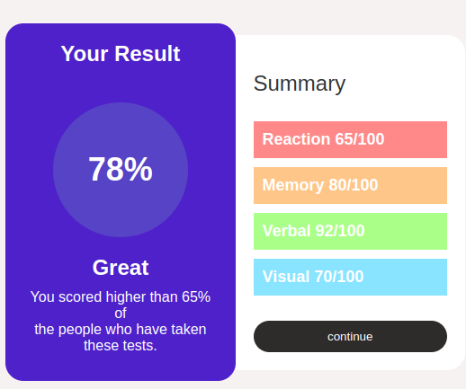

# Frontend Mentor - Results summary component solution

This is a solution to the [Results summary component challenge on Frontend Mentor](https://www.frontendmentor.io/challenges/results-summary-component-CE_K6s0maV). Frontend Mentor challenges help you improve your coding skills by building realistic projects. 

## Table of contents

- [Overview](#overview)
  - [The challenge](#the-challenge)
  - [Screenshot](#screenshot)
  - [Links](#links)
- [My process](#my-process)
  - [Built with](#built-with)
  - [What I learned](#what-i-learned)
  - [Continued development](#continued-development)
  - [Useful resources](#useful-resources)
- [Author](#author)
- [Acknowledgments](#acknowledgments)


## Overview

### The challenge

Users should be able to:

- View the optimal layout for the interface depending on their device's screen size
- See hover and focus states for all interactive elements on the page

### Screenshot




### Links

- Solution URL:https://github.com/Mel-ca/score-sheet)
- Live Site URL:https://mel-ca.github.io/score-sheet/)

## My process

### Built with

- Semantic HTML5 markup
- CSS custom properties
- Flexbox
- CSS Grid
- Mobile-first workflow
- [React](https://reactjs.org/) - JS library
- [Next.js](https://nextjs.org/) - React framework
- [Styled Components](https://styled-components.com/) - For styles


### What I learned

During this project, I gained experience in using JavaScript to create interactive user interfaces in the frontend. I also learned how to use modern CSS techniques such as flexbox and CSS grid to create a responsive layout.Overall, this project helped me improve my frontend development skills and gain valuable experience in using modern technologies.


```html
<div class="right-column">
    <h4>Summary</h4> <br>
    <div class="rating" style="background-color: #FF8989;">Reaction 65/100</div>
    <div class="rating" style="background-color: #FFC689;">Memory 80/100</div>
    <div class="rating" style="background-color: #AAFF89;">Verbal 92/100</div>
    <div class="rating" style="background-color: #89E4FF;">Visual 70/100</div> <br>
    <button type="submit">continue</button>
  </div>
```
```css
 .rating:nth-child(1) {
      background-color: #FF8989;
    }

    .rating:nth-child(2) {
      background-color: #FFC689;
    }

    .rating:nth-child(3) {
      background-color: #AAFF89;
    }

    .rating:nth-child(4) {
      background-color: #89E4FF;
    }
```
```js
<script>
      // Calculate average rating
      const reactionRating = 65;
      const memoryRating = 80;
      const verbalRating = 90;
      const visualRating = 75;
      const totalRatings = 4;
      const averageRating = (reactionRating + memoryRating + verbalRating + visualRating) / totalRatings;

      // Update average rating in the circle
      const averageCircle = document.getElementById('average-circle');
      averageCircle.textContent = Math.round(averageRating);
    </script>

```


### Continued development

In future projects, I plan to continue focusing on responsive design and accessibility. I also plan to explore more advanced CSS techniques, such as CSS animations and custom properties. I also plan to add icons in CSS.


### Useful resources

- [MDN Web Docs] - A comprehensive resource for web developers
-CSS-Tricks - A website dedicated to all things CSS
-A11Y Project - A resource for accessibility best practices

## Author


- Frontend Mentor - [@melonielangat](https://www.frontendmentor.io/profile/melonielangat)
- Twitter - [@melonielangat](https://www.twitter.com/melonielangat)


## Acknowledgments

I would like to thank Frontend Mentor for providing this challenge, as well as the helpful resources and community available on their platform.

